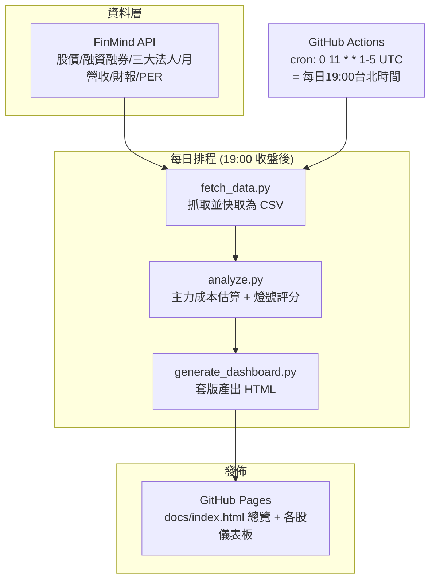

# 台股波段 AI Agent 儀表板 — 架構設計文件

版本：v1.1　日期：2026-07-03　範例個股：2618 長榮航（可於 `config.yaml` 自由調整追蹤清單）

> 本版已依需求調整：**移除盤中即時大單監控與 LINE 通知**，範圍聚焦在「收盤後自動更新視覺化
> 儀表板 + 近兩週主力持倉成本分析」。若之後想恢復即時警示功能，可再告訴我，架構上可以隨時
> 重新加回來。

---

## 1. 目標與範圍

以你提供的截圖為基準，設計並實作一套可自動運作的台股個股分析儀表板，具備兩個核心能力：

1. **每日收盤後（19:00）自動更新** — 抓取最新籌碼、技術、基本面資料，重新計算評分並產出視覺化 HTML 報告。
2. **近兩週主力（三大法人）持倉成本分析** — 估算主力目前的平均成本與現價的浮盈虧，作為判斷「主力是否套牢／得利」的依據。

---

## 2. 系統架構總覽



**關鍵設計決策：排程跑在 GitHub Actions，而不是這個 Claude 對話環境本身。**
原因：本雲端工作環境的對外網路採用白名單限制，實測對 `api.finmindtrade.com`、
`www.twse.com.tw`、`query1.finance.yahoo.com` 等外部資料來源都會被 Proxy 擋下（403 / Tunnel
連線失敗）。這代表即使把排程綁定在這個 Claude session 上，到了執行時間也抓不到真實資料。
GitHub Actions 的 runner 有完整對外網路，且免費額度（public repo 無限、private repo 每月
2,000 分鐘）足夠這種輕量排程，所以是目前最穩定、免費、且不受單一 session 生命週期影響的方案。

---

## 3. 資料層設計

延續截圖中「資料來源：FinMind TaiwanStockPrice / Margin / Institutional / Revenue / PER /
FinancialStatements / BalanceSheet」的既有設計，`fetch_data.py` 對應抓取以下 dataset：

| 用途 | FinMind dataset | 對應本地快取 |
|---|---|---|
| 股價 OHLCV | `TaiwanStockPrice` | `{stock_id}_price.csv` |
| 融資融券餘額 | `TaiwanStockMarginPurchaseShortSale` | `{stock_id}_margin.csv` |
| 三大法人買賣超 | `TaiwanStockInstitutionalInvestorsBuySell` | `{stock_id}_institutional.csv` |
| 股權分散表（週資料） | `TaiwanStockHoldingSharesPer` | `{stock_id}_shareholding.csv` |
| 月營收 | `TaiwanStockMonthRevenue` | `{stock_id}_month_revenue.csv` |
| 損益財報 | `TaiwanStockFinancialStatements` | `{stock_id}_financial_statements.csv` |
| 資產負債表 | `TaiwanStockBalanceSheet` | `{stock_id}_balance_sheet.csv` |
| 本益比/殖利率/淨值比 | `TaiwanStockPER` | `{stock_id}_per.csv` |

- 註冊 [finmindtrade.com](https://finmindtrade.com) 取得免費 token 後，額度會比匿名請求高
  （官方文件僅說明匿名與登入用戶額度不同、超額會回傳 HTTP 402，實際數字請以你註冊後在
  網站的「API 使用次數」頁面顯示為準，因免費/贊助方案的確切門檻會不定期調整）。
- 你截圖中出現的 `broker_trading_history`、`twt72u_history`、`OWZ66U_history` 等檔名，屬於
  更細的分點籌碼資料，FinMind 公開 API 並未提供對應 dataset；先以三大法人買賣超作為「主力」
  的代理指標。

---

## 4. 分析層設計

### 4.1 近兩週主力（三大法人）持倉成本估算

```
主力成本 = Σ(當日淨買超股數 × 當日收盤價) / Σ(當日淨買超股數)
          （只加總「三大法人合計淨買超 > 0」的交易日，回溯近 20 個交易日 ≈ 4 週）
```

- 這是業界常見的「籌碼成本估算」簡化模型，假設買超當天的成交集中在收盤價附近，藉此推估主力
  目前部位的均價。它是**估算值**，不是交易所公開的真實成交均價，因此儀表板會同時顯示「買超
  天數 / 總天數」讓你判斷估算的可信度（買超天數越多、樣本越足，估算越穩定）。
- 回溯天數（`lookback_trading_days`，預設 10）與計算基礎（三大法人合計 vs. 僅外資 vs. 僅投信）
  都可在 `config.yaml` 調整。
- 浮盈虧 = (現價 − 主力成本) / 主力成本 × 100%，正值代表主力目前平均是賺的，負值代表主力
  目前平均是套牢的。

### 4.2 燈號與評分規則

| 指標 | 資料來源 | 計算邏輯（簡化版，可於 `analyze.py` 調整） |
|---|---|---|
| 籌碼乾淨度 | 融資餘額變化 | 近 10 日融資餘額下降 → 分數高（籌碼安定）；大幅增加 → 分數低（融資追價風險） |
| 主力布局分數 | 三大法人買賣超 | 買超天數比例(50%) + 買超力道是否加速(50%) |
| 技術趨勢 | 5/20/60 日均線排列 | 多頭排列(5>20>60)=偏多；空頭排列=偏空；其餘=盤整 |
| 長期均線乖離 | 現價 vs 60日均線 | \|乖離率\| < 20% 視為安全，避免追高/追空 |
| 基本面催化 | 月營收年增率 + PER 分位數 | 年增率越高分數越高；PER 分位數輔助判斷是否處於相對低檔 |
| 綜合評分 | 上述四項加權平均 | 預設權重：籌碼25% / 主力布局30% / 技術20% / 基本面25%，可於 `config.yaml` 調整 |

評分門檻（綠/黃/紅燈）與權重都集中在 `config.yaml -> scoring`，方便你依自己的操作邏輯微調，
不需要改程式碼。

### 4.3 買賣訊號（`scripts/signals.py`）

在燈號評分之外，另外提供三種訊號，分成兩種類型：

- **事件型**：只在「今天發生變化」時才出現，隔天沒有新變化就會顯示「無訊號／維持原狀」，
  不會每天重複顯示同一件事。
- **狀態型**：只要條件持續成立就會一直顯示，不是只出現一次。

| 訊號 | 類型 | 判斷邏輯 | 是否需要跨日狀態 |
|---|---|---|---|
| A. 均線黃金／死亡交叉 | 事件型 | 5日均線由下往上穿越20日均線＝黃金交叉（偏多）；由上往下穿越＝死亡交叉（偏空）。只看最近兩個交易日的均線相對位置是否翻轉 | 否，當次股價歷史即可算出 |
| B. 評分區間轉換 | 事件型 | 綜合評分所屬的「觀望／區間／布局」三個區間，若跟前一次執行結果不同，就標記轉強或轉弱 | **是**，需要讀寫 `state/{stock_id}_state.json` 記錄上一次的區間 |
| C. 主力成本防守價 | 狀態型 | 現價是否低於 4.1 節估算出的主力成本，跌破就持續顯示警示，直到現價收復為止 | 否，當次資料即可比較 |

B 是唯一需要跨日比較的訊號，因為工作流程每次都是全新的 GitHub Actions 執行環境，不會記得
「昨天」的結果，所以每次執行都會把當天算出的區間寫進 `state/` 資料夾，並跟著 `docs/` 一起
`git commit` 回 repo，下一次執行時 `actions/checkout` 會把這份記錄一併抓回來，藉此比較出
「有沒有變化」。**第一次執行時因為沒有「前一天」可比較，這個訊號會顯示「首次執行，尚無歷史
資料可比較」，屬於正常現象，不是錯誤。**

三種訊號都是規則式計算（不是機器學習或黑箱模型），邏輯全部寫在 `scripts/signals.py`，門檻或
判斷方式都可以直接改程式碼調整。

---

## 5. 呈現層設計

`templates/dashboard_template.html` 延續你截圖的版面骨架：

1. 頂部：個股代號/名稱、建議標籤（建議布局／區間操作／建議觀望，依綜合評分自動切換）、
   分析週期、風險偏好、持股狀態，右側資料日期表。
2. 「總控視覺儀表板」：綜合評分、風險等級、籌碼乾淨度、主力布局分數、技術趨勢、技術線型、
   長期均線乖離、基本面催化，8 宮格卡片。
3. 「近兩週主力持倉成本分析」：估算成本、現價、浮盈虧、買超天數，4 宮格重點卡片。
4. 「籌碼與技術風險燈號」：7 個指標的紅黃綠燈號格，維持你截圖的視覺語言。
5. 「買賣訊號」：均線交叉、評分區間轉換、主力成本防守價，3 張訊號卡，觸發中的事件型訊號會用
   較粗的邊框標示出來，方便一眼看出「今天有沒有新訊號」。

色彩採用可讀性驗證過的語意色（綠 `#0ca30c` / 黃 `#fab219` / 紅 `#d03b3b`），並搭配文字標籤
（例如「良好」「留意」「警示」）而非僅用顏色，避免色弱使用者無法辨識。

---

## 6. 自動化排程設計

**建議方案：GitHub Actions 排程工作流程**（已提供 `.github/workflows/daily_update.yml`）

1. 把這個專案推到你自己的 GitHub repo（public 或 private 皆可，private 需留意每月 Actions
   分鐘數）。
2. 在 repo 的 `Settings → Secrets and variables → Actions` 新增：
   - `FINMIND_TOKEN`
3. workflow 會在**每日 UTC 11:00（= 台北時間 19:00）、週一到週五**自動觸發，依序執行
   抓資料 → 分析 → 產出 HTML → 把結果與訊號狀態 commit 到 `docs/`、`state/` → 發布到 Pages。
4. 到 repo 的 `Settings → Pages`，Source 選 **GitHub Actions**（不是 Deploy from a branch，
   實測 branch 部署方式偶爾會出現不穩定的 `Deployment failed` 問題，改用 workflow 自帶的
   `actions/deploy-pages` 發布比較可靠），即可得到一個固定網址
   （例如 `https://<你的帳號>.github.io/<repo>/`），每天 19:00 後自動更新，手機、電腦都能開。
5. 也保留 `workflow_dispatch`，你可以隨時到 Actions 頁面手動按「Run workflow」立即更新一次，
   不用等到晚上。

> 國定假日台股不開盤時，workflow 仍會在 19:00 執行，但因為 FinMind 當天沒有新資料，
> 儀表板數字會維持前一交易日不變，不影響正確性，只是多一次無意義的執行，可忽略或之後加上
> 交易日曆判斷來略過。

---

## 7. 風險與限制

1. **主力成本為估算值**：以收盤價加權，並非交易所公開的真實成交均價，僅供研判參考，不應作為
   唯一交易依據。
2. **FinMind 免費額度有限**：追蹤股票數量越多、抓取頻率越高，越容易碰到額度上限（HTTP 402）；
   `fetch_data.py` 已內建重試與明確錯誤訊息，超額時請降低頻率或升級帳號。
3. **本文件與程式碼僅為分析輔助工具，不構成投資建議**：所有評分、燈號、成本估算都是規則式
   計算，實際操作請自行判斷風險並可諮詢專業意見。

---

## 8. 導入檢查清單

- [ ] 註冊 FinMind 帳號，取得 token
- [ ] 把本專案推到你的 GitHub repo，設定 `FINMIND_TOKEN` Secret
- [ ] Settings → Pages，Source 選 **GitHub Actions**，確認每日 19:00 後有自動更新
- [ ] 確認 `state/` 資料夾有跟著每次執行被 commit 回 repo（買賣訊號裡的「評分區間轉換」需要它）

---

## 附錄：專案檔案結構

```
taiwan-stock-dashboard/
├── ARCHITECTURE.md                 <- 本文件
├── requirements.txt
├── config/
│   └── config.example.yaml         <- 複製為 config.yaml 並填入 FinMind token
├── scripts/
│   ├── fetch_data.py                <- 資料層：呼叫 FinMind API
│   ├── analyze.py                   <- 分析層：主力成本 + 燈號評分
│   ├── signals.py                   <- 買賣訊號層：均線交叉／評分轉換／主力成本防守價
│   ├── generate_dashboard.py        <- 呈現層：套版產出 HTML
│   └── daily_update.py              <- 主排程入口
├── templates/
│   └── dashboard_template.html      <- 視覺化樣板（比照你的截圖版型）
├── output/                          <- 產出的 HTML 與快取 CSV（每次執行重新產生，不需要保留歷史）
├── state/                           <- 買賣訊號的跨日狀態記錄（會被 git commit，需要長期保留）
└── .github/workflows/
    └── daily_update.yml             <- GitHub Actions 每日19:00排程 + 發布 Pages
```
